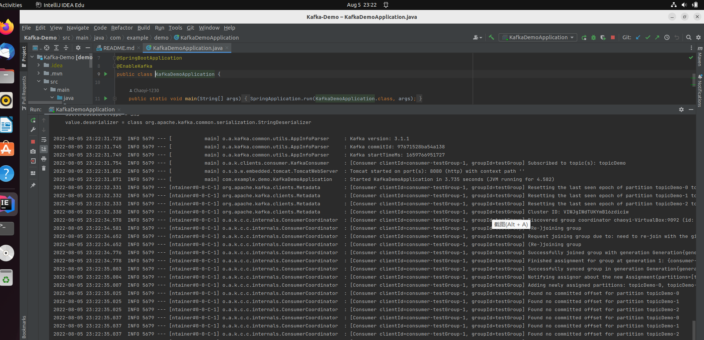
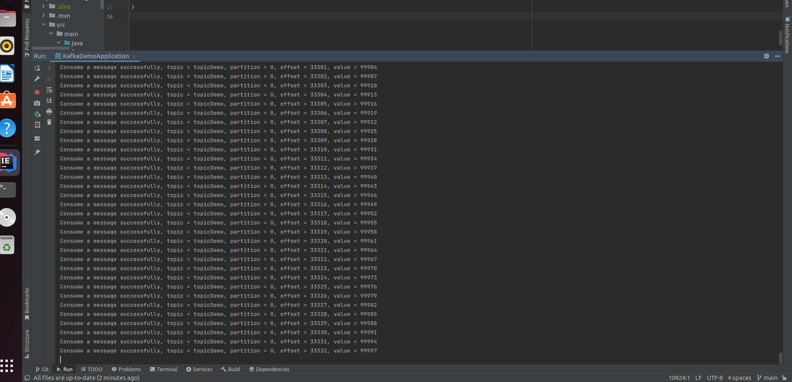

# How to use

## Environment
```shell
# Ubuntu 22.04

# Java 1.8
$ sudo apt install openjdk-8-jdk
$ java -version

# Kafka 3.2.0
$ curl "https://dlcdn.apache.org/kafka/3.2.0/kafka_2.13-3.2.0.tgz" -o ~/Downloads/kafka.tgz
$ mkdir ~/kafka && cd ~/kafka
$ tar -xvzf ~/Downloads/kafka.tgz --strip 1 
```

## Installation
```shell
$ git clone https://github.com/Chaoyism/Kafka-Demo.git
```

## Running Kafka
```shell
# Start the ZooKeeper service in a terminal session.
# Note: Soon, ZooKeeper will no longer be required by Apache Kafka.
$ bin/zookeeper-server-start.sh config/zookeeper.properties

# Start the Kafka broker service in another terminal session.
$ bin/kafka-server-start.sh config/server.properties

# You need a Kafka topic with three or more partitions running.
# If you don't have one, create one using the following command:
# topicDemo is the name of the topic, remember to modify the corresponding name in application.yaml if you name the topic in another way.
$ bin/kafka-topics.sh --create --topic topicDemo --partitions 3 --bootstrap-server localhost:9092
# Create topic topicDemo
```

## Build and Run the Project
Open the folder as a project in Intellij IDEA, build and run locally.


Access Port 8080 and begin sending the messages.
```shell
http://localhost:8080/kafka/send
```


See the Throughput (for 0~99999).


# Details
This part is to respond requirements in the PRD.
## Write to Kafka
Write 0 to 9,999,999 to Kafka. The range of the numbers can be adjusted in application.yaml.

### How to ensure that each number exists only once?
In producer, ACK=all will make the producer to resend a message when it did not receive a feedback from the consumer, ensuring that each number will exist.

In producer, enable.idempotence=true will assign an ID to each message. When the producer did not receive an ACK and resend a message, the broker will check if it has received a message with the same id. If it has, then it will discard the message and send an ACK back to the producer, so that duplications can be avoided.

### How to ensure that partitions have balanced loads?
The kafkaTemplate.send() function can specify the target partition id. In this application, number n will be sent to partition (n-1) % 3, so the balanced loads can be achieved.

### How to ensure that numbers are ordered within each partition?
Because the numbers are sent in ascending order. The latter number will be sent only when the former one has been received and stored (ACK).

## Read from Kafka
Refer to consumeMsg() in Controller.java.

### How to guarantee the exactly-once semantic?
In consumer, enable-auto-commit=false will disable the auto committing.

In consumer, a HashSet is maintained to record the numbers committed, so if the batch is resent, then the committed message in the hashset can be discarded.

## Throughput
It takes 2792ms to produce and consume 100,000 messages.

## Reference
### Configure Kafka
https://kafka.apache.org/quickstart
### Concepts
https://developers.redhat.com/articles/2022/04/05/developers-guide-using-kafka-java-part-1#kafka_architecture
https://www.cnblogs.com/lovesqcc/p/14379440.html
### ACK
https://www.bilibili.com/video/BV1tF411a7od?spm_id_from=333.337.search-card.all.click&vd_source=df0192f388826b8c79a8e582a77586c4
### enable.idempotence
https://kafka.apache.org/11/javadoc/org/apache/kafka/clients/producer/KafkaProducer.html#:~:text=To%20enable%20idempotence%2C%20the%20enable,config%20will%20default%20to%20all%20.
### IDEA, Java, Maven and Spring
https://www.youtube.com/watch?v=MFMzxdpn6v4
https://stackoverflow.com/questions/56667985/could-not-resolve-placeholder-kafka-bootstrap-servers-in-string-value-kafka
https://spring.io/projects/spring-kafka
https://www.tutorialspoint.com/spring_boot/spring_boot_apache_kafka.htm
https://github.com/spring-projects/spring-kafka
### Further Readings on Rust
https://ohmyweekly.github.io/notes/2021-04-14-getting-started-with-kafka-and-rust-part1/
https://www.confluent.io/blog/getting-started-with-rust-and-kafka/#:~:text=Rust%20libraries%20for%20Kafka,is%20a%20wrapper%20for%20librdkafka.
https://docs.rs/kafka/latest/kafka/

